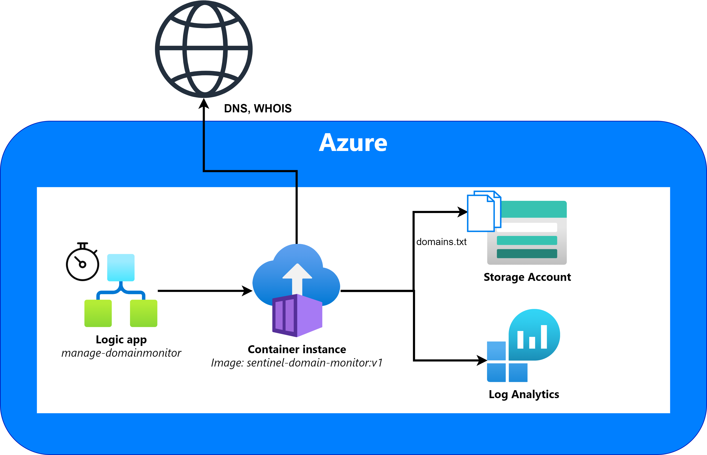
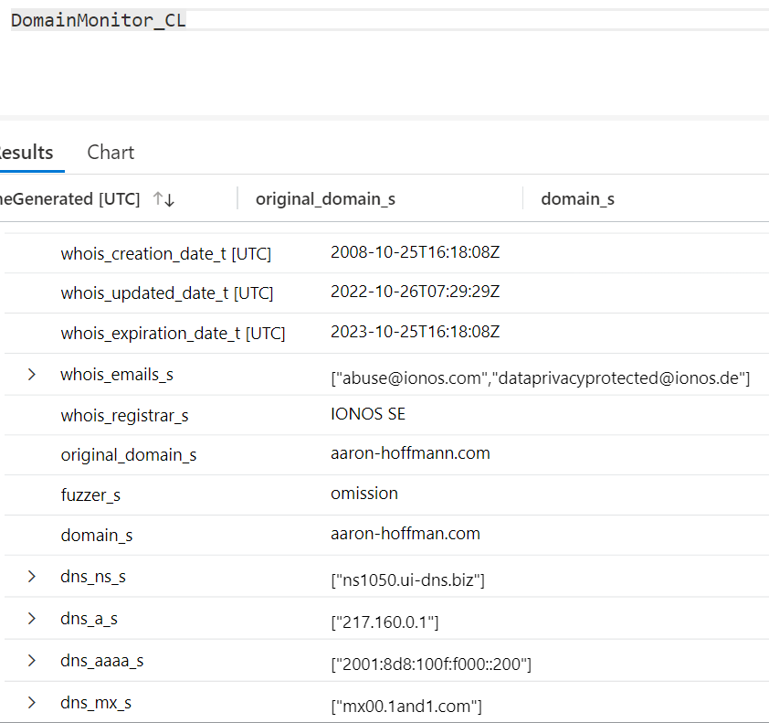

# MicrosoftSentinel-DomainMonitor
Python and golang program that takes a list of domains and uses [dnstwist](https://github.com/elceef/dnstwist) to check for active lookalikes with WHOIS enrichment. Designed to be used with Azure Log Analytics and Microsoft Sentinel.

# Run with Azure Containers

A Dockerfile has been provided to run this in an Azure Container Instance.

For full details on getting started with Azure Container Instances, check out the [official documentation](https://learn.microsoft.com/azure/container-instances/container-instances-quickstart-portal).

## ACI manual setup - Build the image yourself

Expand

1. Create an Azure Container Registry
2. Log in to your registry: `az acr login --name <registry-name>`
3. Clone the repository and cd to the directory: `cd SentinelDomainMonitor/`
4. Build the image: `docker build -t sentinel-domain-monitor .`
5. After the image has been built, tag the image for your container registry: `docker tag sentinel-domain-monitor:v1 <registry-login-server>/sentinel-domain-monitor:v1`
6. Push the image to the registry: `docker push <login-server>/sentinel-domain-monitor:v1`
7. Once the image has been uploaded, create a container instance. You can use the default size of 1 vCPU and 1.5GB memory
8. Wait for the container run to complete, and verify you see events in the DomainMonitor_CL Log Analytics table

## ACI manual setup - Use my DockerHub image

Expand

1. Create a new container instance
2. Under Image Source, select 'Other'
3. Enter the value: `appaphd/dnstwist-dnsx-combo:v1`
4. Set OS type as Linux
5. You can use the default size of 1 vCPU and 1.5GB memory
6. Wait for the container run to complete, and verify you see events in the DomainMonitor_CL Log Analytics table

## Environment variables
When creating the container, set the following environment variables in the Advanced tab:
- `WORKSPACE_ID`: your log analytics workspace ID
- `SHARED_KEY`: your log analytics workspace primary key
- `azure_storage_account`: the name of the storage account
- `azure_storage_blob_name`: the name of the blob that contains the domains to be monitored
- `azure_storage_container`: the name of the blob storage container

## Configuring watched domains
- If deploying using the provided ARM/Bicep template, place your watched domains in a text file named `domains.txt` and upload it to the blob storage container that was created.
- If deploying manually, place your domains.txt file in the same directory as the Dockerfile and uncomment the line `#COPY domains.txt .`

## Optional - control container with a Logic App
If you'd like to automatically start the container, an example [logic app](./Playbooks/Manage-DomainMonitorContainer/) has been included.
The logic app is set to trigger once a day.

## Configuration
Place the domains you want to monitor in the `domains.txt` file, one per line.

Set the following environment variables:
* WORKSPACE_ID: your log analytics workspace ID
* SHARED_KEY: your log analytics workspace primary key

## Logging
SentinelDomainMonitor write logs locally to `logs/domain_monitor.log` in the container, and to Log Analytics under the table name "DomainMonitor_CL".

This template creates the following resources:
* Azure Container Instance that points to my DockerHub image
* Storage Account and Blob storage container
* Role assignment providing container instance Azure Blob Storage Reader access to the storage account
* Playbook
